# Pattern Designs

create by: Jose Carlos Huerta

## index 🚀

- [Creation 🗺️](#creation-)
  - [Abstract Factory 🏭](#abstract-factory-)
    - [Documentation](#documentation)
    - [Implementations](#implementations)
    - [Diagram UML](#diagram-uml)
  - [Factory Method](#factory-method)
    - [Documentation](#factory-method---documentation)
    - [Implementations](#factory-method---implementations)
    - [Diagram UML](#factory-method---diagram-uml)
  - [Builder](#builder)
    - [Documentation](#builder-method---documentation)
    - [Implementations](#builder---implementations)
    - [Diagram UML](#builder---diagram-uml)
- [Structural](#structural)
  - [Bridge](#bridge)
    - [Documentation](#documentation-1)
    - [Implementation](#implementation)
  - [Composite](#composite)
    - [Documentation](#documentation-2)
    - [Implementation](#implementation-1)
  - [Decorator](#decorator)
    - [Documentation](#documentation-3)
    - [Implementation](#implementation-2)
  - [Facade](#facade)
    - [Documentation](#documentation-4)
    - [Implementation](#implementation-3)
  - [Flyweight](#flyweight)
    - [Documentation](#documentation-5)
    - [Implementation](#implementation-4)
  - [Proxy](#proxy)
    - [Documentation](#documentation-6)
    - [Implementation](#implementation-5)
- [Behavior 🤖](#behavior-)
  - [Strategy 🧠](#strategy-)
    - [Documentation 📚](#documentation-📚)
    - [Implementations 📚](#implementations-📚)
  - [Observer](#observer)
    - [Documentation 📚](#documentation-📚-1)
    - [Implementations 📚](#implementations-📚-1)

## Creation 🗺️

### Abstract Factory 🏭

#### Documentation

- [refactoring.guru - Abstract Factory](https://refactoring.guru/design-patterns/abstract-factory)

- [YouTube - BettaTech - ABSTRACT FACTORY | PATRONES de DISEÑO](https://www.youtube.com/watch?v=CVlpjFJN17U)

#### Implementations

- [Books](src/creations/AbstractFactory/Books/index.ts)
- [Clothes](src/creations/AbstractFactory/Clothes/indexFactory.ts)

#### Diagram UML

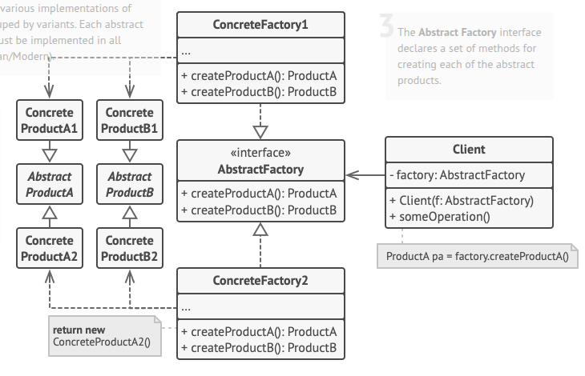

### Factory Method

#### Factory Method - Documentation

- [refactoring.guru - Factory Method](https://refactoring.guru/es/design-patterns/factory-method)

- [refactoring.guru - Example TypeScript](https://refactoring.guru/es/design-patterns/factory-method/typescript/example)

- [YouTube - The Factory Method Pattern Explained and Implemented in Java | Creational Design Patterns | Geekific](https://www.youtube.com/watch?v=EdFq_JIThqM&t=119s)

#### Factory Method - Implementations

- [Orders](src/creations/FactoryMethod/Orders)
- [Travels](src/creations/FactoryMethod/Traveling)

#### Factory Method - Diagram UML

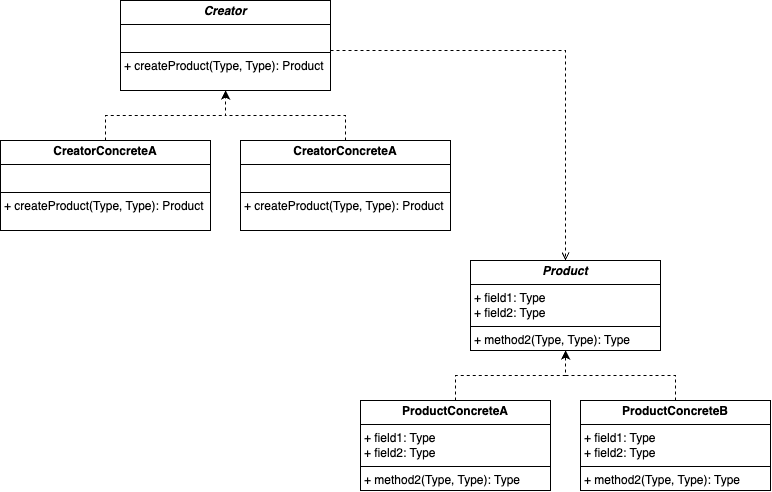

### Builder

#### Builder Method - Documentation

- [refactoring.guru - Builder Method](https://refactoring.guru/design-patterns/builder)

- [refactoring.guru - Example TypeScript](https://refactoring.guru/design-patterns/builder/typescript/example)

- [How does Builder Design Pattern solves problems like URL creation?](https://www.youtube.com/watch?v=4ff_KZdvJn8)

#### Builder - Implementations

- [Airplanes](src/creations/Builder/Airplanes)
- [Character](src/creations/Builder/Character)

#### Builder - Diagram UML

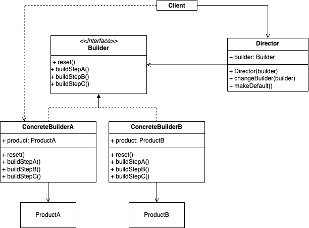

## Structural

### Bridge

#### Documentation

- [YouTube](https://www.youtube.com/watch?v=6bIHhzqMdgg)

#### Implementation

- [Implementation](src/structures/Bridge)

### Composite

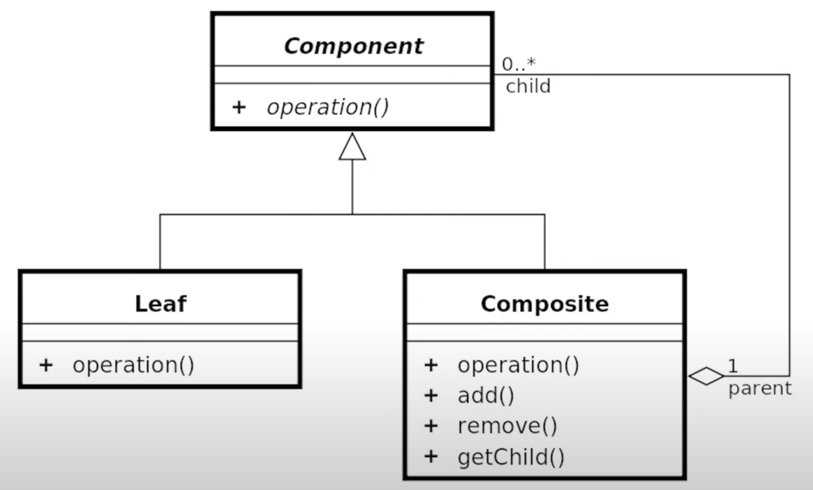

#### Documentation

- [YouTube](https://www.youtube.com/watch?v=ES3DnAPted0)
- [Refactoring Guru](https://refactoring.guru/design-patterns/composite)

#### Implementation

- [Forms](src/structures/Composite/Forms/)
  - use this when you need save values to operate with the main method of interface of Composite

### Decorator

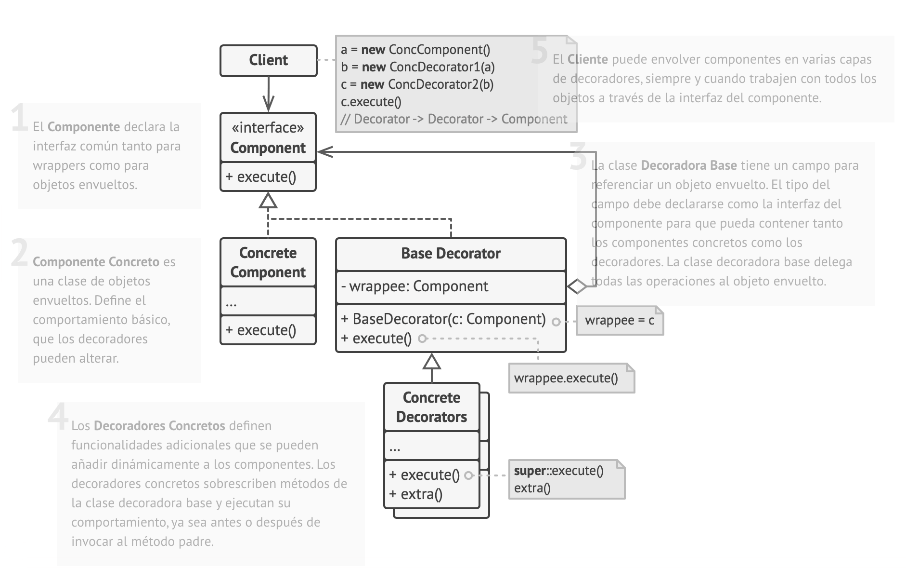
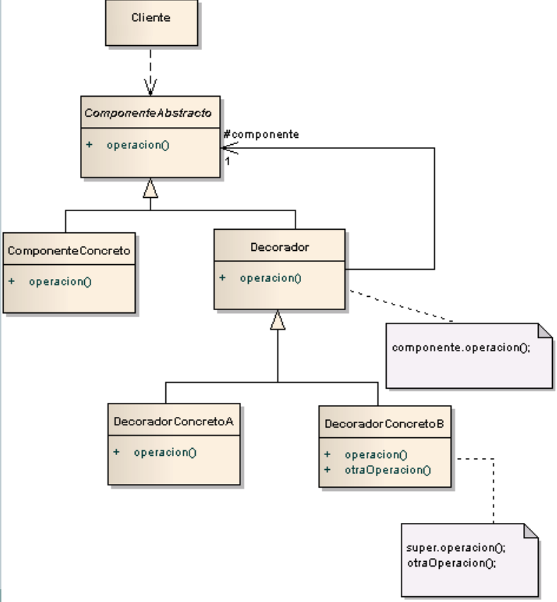

- Añadir funcionalidades anidando objetos en otros objectos
- Se sugiere que ninguna funcionalidad debe de depender de otra funcionalidad
- Se sugiere que las Entidades Decoradas pertenezcan:
  - A un mismo nivel de abstracción
  - A un mismo grupo de conceptualization
    - OK: Convertir un doc -> pdf, html, xml, etc.
    - NOT OK: Convertir un doc -> pdf, cerrar sesión, enviar por correo

#### Documentation

- [Refactoring Guru](https://refactoring.guru/es/design-patterns/decorator)
- [Fernando Herrera - [S16/L1] Patrones de Diseño - Soluciones prácticas y eficientes: Decorator | Patrón](https://www.youtube.com/watch?v=uLaFPDB53X0)
- [Fernando Herrera - [S16/L2] Patrones de Diseño - Soluciones prácticas y eficientes: Decorator | Utilización](https://www.youtube.com/watch?v=zAcu20tjZJc)

#### Implementation

- [Convertidor de documentos](src/structures/Decorator/ConvertDocs)
- [Render HTML](src/structures/Decorator/HTML)

## Facade

- Utiliza el patrón Facade cuando necesites una interfaz limitada pero directa a un subsistema complejo.

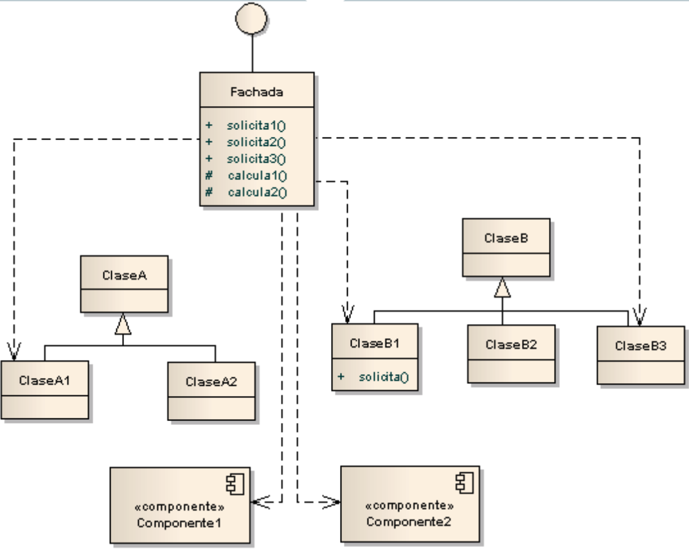

#### Documentation

- [Refactoring Guru - Facade](https://refactoring.guru/es/design-patterns/facade)

#### Implementation

- [Register with social media](src/structures/Facade/RegisterSocialMedia)

## Flyweight

- The factory has to manage the heavy resources
- When one resource is created, this should be hashed to easy find

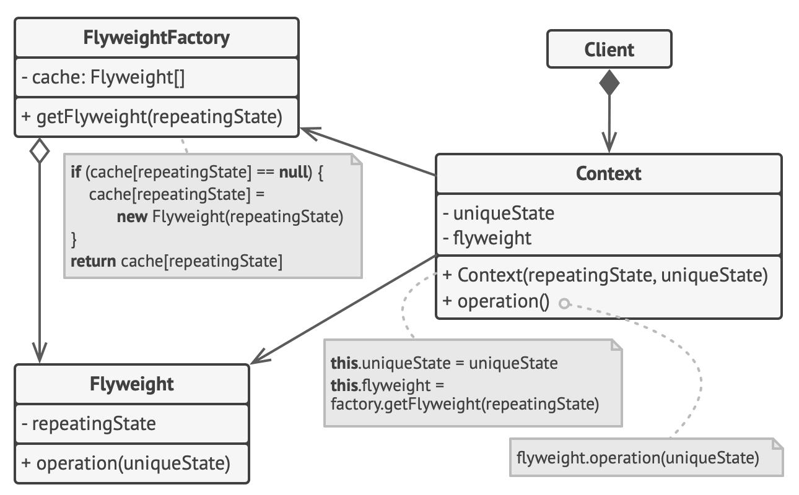

#### Implementation

- [Simple Game](src/structures/Flyweight/SimpleGame)
  - Client - Game
  - Context - Canvas
  - Factory - EmojiFactory
  - Flyweight - EmojiFlyweight
    - State Extrinsic - EmojiExtrinsico

#### Documentation

- [YouTube - FLYWEIGHT en 2 MINUTOS | PATRONES DE DISEÑO SOFTWARE](https://www.youtube.com/watch?v=0N7C-XzT2Nw)
- [YouTube - Patrones de diseño - 03 Flyweight](https://www.youtube.com/watch?v=R9KO6sojNTE&t=61s)
- [Refactoring Guru - Flyweight](https://refactoring.guru/es/design-patterns/flyweight)

## Proxy

- Un proxy controla el acceso al objeto original, permitiéndote hacer algo antes o después de que la solicitud llegue al objeto original.

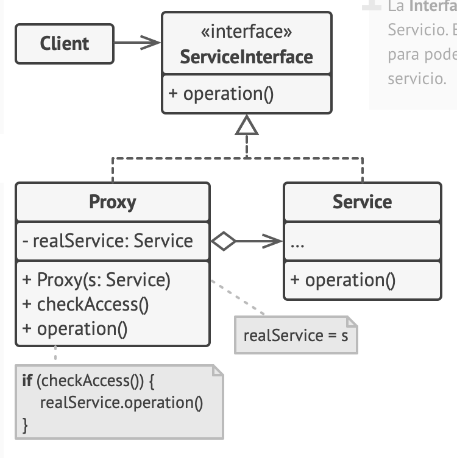

### Implementation

- [Get Photos Instagram With Cache](src/structures/Proxy/GetMyPhotosInstagram)

### Documentation

- [Refactoring Guru - Proxy](https://refactoring.guru/es/design-patterns/proxy)

# Behavior 🤖

## Strategy 🧠

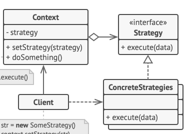

### Documentation 📚

- [Refactoring Guru - Strategy](https://refactoring.guru/design-patterns/strategy)
- [STRATEGY | PATRONES de DISEÑO](https://www.youtube.com/watch?v=VQ8V0ym2JSo)

### Implementations 📚

#### [Register users](src/behavior/Strategy/RegisterUser)

- Client
  - [Client](src/behavior/Strategy/RegisterUser/Client.ts)
- Context
  - [CreateUser.application.ts ](src/behavior/Strategy/RegisterUser/application/CreateUser.application.ts)
- Strategies
  - [CreateUser.UseCase.ts](src/behavior/Strategy/RegisterUser/domain/useCases/CreateUser/CreateUser.UseCase.ts)
    - [RegisterUser.domain.ts](src/behavior/Strategy/RegisterUser/domain/useCases/CreateUser/functions/RegisterUser.domain.ts)
    - [SendWelcomeEmail.domain.ts](src/behavior/Strategy/RegisterUser/domain/useCases/CreateUser/functions/SendWelcomeEmail.domain.ts)
  - [Logger.domain.ts](src/behavior/Strategy/RegisterUser/domain/commons/Logger.domain.ts)
- Concrete strategies
  - [CreateUser.UseCase.ts](src/behavior/Strategy/RegisterUser/domain/useCases/CreateUser/CreateUser.UseCase.ts)
    - [RegisterUser.json.ts](src/behavior/Strategy/RegisterUser/infrastructure/useCases/CreateUser/json/RegisterUser.json.ts)
    - [RegisterUser.Mock.ts](src/behavior/Strategy/RegisterUser/infrastructure/useCases/CreateUser/mock/RegisterUser.Mock.ts)
    - [SendWelcomeEmail.twilio.ts](src/behavior/Strategy/RegisterUser/infrastructure/useCases/CreateUser/twilio/SendWelcomeEmail.twilio.ts)
  - [Logger.CloudWatch.ts](src/behavior/Strategy/RegisterUser/infrastructure/commons/Logger.CloudWatch.ts)
  - [Logger.Sentry.ts](src/behavior/Strategy/RegisterUser/infrastructure/commons/Logger.Sentry.ts)

## Observer

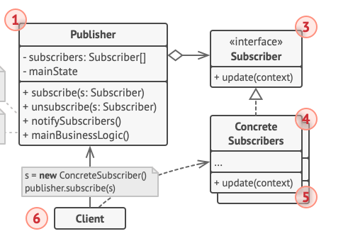
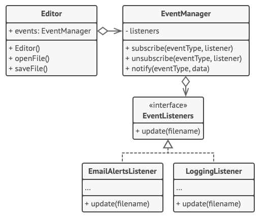

### Documentation 📚

- [The Observer Pattern Explained and Implemented in Java | Behavioral Design Patterns | Geekific](https://www.youtube.com/watch?v=-oLDJ2dbadA)
- [Observer Design Pattern - Beau teaches JavaScript](https://www.youtube.com/watch?v=3PUVr8jFMGg)
- [Refactoring Guru - Observer](https://refactoring.guru/design-patterns/observer)

### Implementations 📚

#### [MusicPlayer](src/behavior/Observer/MusicPlayer)

- Client
  - [Client](src/behavior/Observer/MusicPlayer/Client.ts)
- Subscriber - EvenListeners
  - [EventListener](src/behavior/Observer/MusicPlayer/domain/useCase/PlayMusic/actions/EventListener.action.ts)
  - Concrete
    - [PauseLogListener.consoleLog](src/behavior/Observer/MusicPlayer/infrastructure/consolelogs/useCase/PlayMusic/actions/PauseLogListener.consoleLog.ts)
    - [PlayLogListener.consoleLog](src/behavior/Observer/MusicPlayer/infrastructure/consolelogs/useCase/PlayMusic/actions/PlayLogListener.consoleLog.ts)
    - [PrintLogListener.consoleLog](src/behavior/Observer/MusicPlayer/infrastructure/consolelogs/useCase/PlayMusic/actions/PrintLogListener.consoleLog.ts)
    - [SimplePrintLyric.consoleLog](src/behavior/Observer/MusicPlayer/infrastructure/consolelogs/useCase/PlayMusic/actions/SimplePrintLyric.consoleLog.ts)
- EventManager
  - [EventManager](src/behavior/Observer/MusicPlayer/domain/useCase/PlayMusic/actions/EventManager.action.ts)
- Publisher - Player
  - [Player](src/behavior/Observer/MusicPlayer/domain/models/businessEntity/Player.entity.ts)
